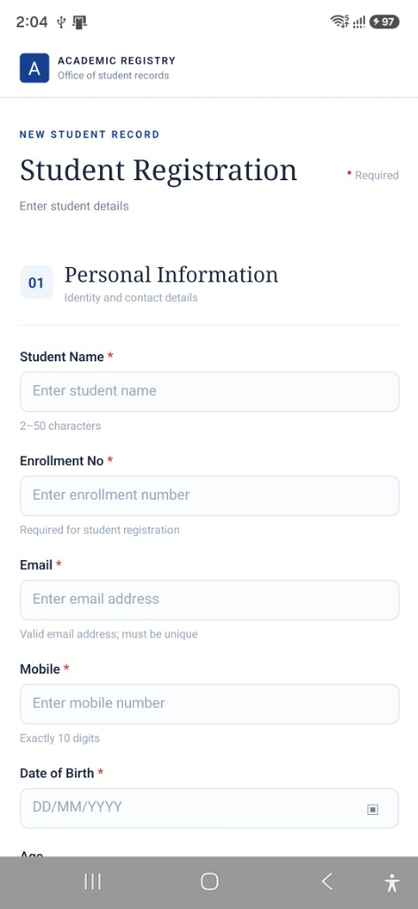
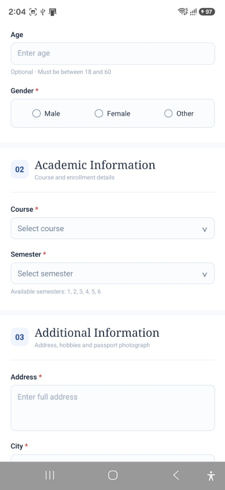
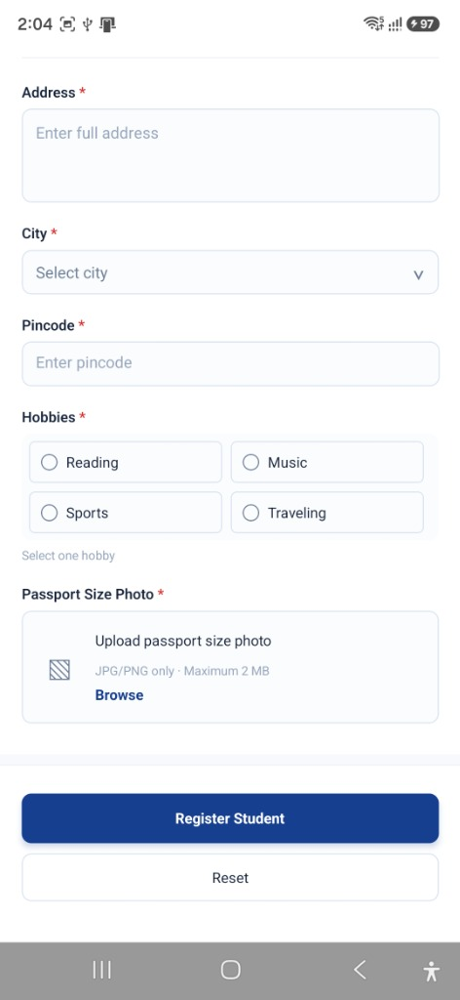

# 📱 StudentRegistrationApp

A professional **Student Registration** mobile application built with **React Native** and **TypeScript**. This app provides a clean, modern UI for registering student information with comprehensive form validation, date picker, image upload, and a detailed student details display screen.

---

## 📋 Project Description

**StudentRegistrationApp** is a mobile application designed to streamline the student registration process. It features a multi-section registration form that captures personal, academic, and additional student information. The app enforces strict validation rules to ensure data accuracy and provides real-time error feedback to the user. Upon successful registration, the app navigates to a summary screen displaying all the submitted student details.

---

## ✨ Features

- 📝 **Multi-Section Registration Form** — Organized into Personal Information, Academic Information, and Additional Information sections
- ✅ **Real-Time Form Validation** — Validates all required fields with descriptive error messages
- 📅 **Custom Date Picker** — Built-in calendar modal with month/year selection for Date of Birth
- 📸 **Passport Photo Upload** — Image picker integration with file size (2 MB) and format (JPG/PNG) validation
- 🔘 **Gender Selection** — Radio-button-style selector with Male, Female, and Other options
- 🎯 **Hobby Selection** — Multi-select checkbox grid for hobbies (Reading, Music, Sports, Traveling)
- 📋 **Dropdown Selectors** — Modal-based pickers for Course, Semester, and City fields
- 📄 **Student Details Display** — Summary screen showing all registered student data with a success message
- 🔄 **Form Reset** — One-tap reset to clear all form fields
- 🎨 **Professional UI Design** — Clean, modern interface with branded header and section numbering

---

## 🛠️ Technologies Used

| Technology         | Description                                      |
| ------------------ | ------------------------------------------------ |
| **React Native**   | Cross-platform mobile app framework               |
| **TypeScript**     | Statically typed superset of JavaScript            |
| **React Navigation** | Screen navigation (Native Stack Navigator)      |
| **Android Studio** | Android development IDE                           |
| **Android Emulator (AVD)** | Android Virtual Device for testing        |
| **react-native-image-picker** | Image selection from device gallery    |
| **react-native-safe-area-context** | Safe area handling for all devices |
| **react-native-screens** | Native navigation screen containers         |

---

## 🚀 Project Creation

This project was created using the React Native Community CLI:

```bash
npx @react-native-community/cli@latest init StudentRegistrationApp
```

### Prerequisites

Make sure you have the following installed before proceeding:

- **Node.js** (>= 22.11.0)
- **npm** (comes with Node.js)
- **Java Development Kit (JDK)**
- **Android Studio** with Android SDK
- **Android Virtual Device (AVD)** configured in Android Studio

> 📌 Follow the official [React Native Environment Setup](https://reactnative.dev/docs/set-up-your-environment) guide to configure your development environment.

---

## ▶️ How to Run

### Step 1: Install Dependencies

```bash
cd StudentRegistrationApp
npm install
```

### Step 2: Start Metro Bundler

```bash
npm start
```

### Step 3: Run on Android

Open a new terminal and run:

```bash
npm run android
```

> 💡 Make sure your Android Emulator is running or a physical device is connected via USB debugging.

---

## 📝 Student Registration Form

The registration form is divided into **three sections** for a clean and organized user experience:

### Section 01 — Personal Information

| Field            | Type          | Required | Validation Rules                          |
| ---------------- | ------------- | -------- | ----------------------------------------- |
| Student Name     | Text Input    | ✅       | 2–50 characters                           |
| Enrollment No    | Text Input    | ✅       | Cannot be empty                           |
| Email            | Text Input    | ✅       | Must be a valid email format               |
| Mobile           | Number Input  | ✅       | Exactly 10 digits                         |
| Date of Birth    | Date Picker   | ✅       | Must be a valid past date (DD/MM/YYYY)     |
| Age              | Number Input  | ❌       | Optional; must be between 18 and 60        |
| Gender           | Radio Buttons | ✅       | Male / Female / Other                     |

### Section 02 — Academic Information

| Field    | Type     | Required | Options                                                    |
| -------- | -------- | -------- | ---------------------------------------------------------- |
| Course   | Dropdown | ✅       | B.Sc.IT, M.Sc.IT, BCA, MCA, BBA, MBA, B.Com, M.Com, B.Tech, M.Tech |
| Semester | Dropdown | ✅       | 1, 2, 3, 4, 5, 6                                           |

### Section 03 — Additional Information

| Field               | Type           | Required | Validation Rules                       |
| ------------------- | -------------- | -------- | -------------------------------------- |
| Address             | Multiline Text | ✅       | Cannot be empty                        |
| City                | Dropdown       | ✅       | Surat, Nadiad, Anand, Vadodara, Ahmedabad, Pune, Mumbai, Delhi, Bangalore, Chennai, Kolkata, Hyderabad |
| Pincode             | Number Input   | ✅       | Valid 6-digit Indian pincode            |
| Hobbies             | Checkboxes     | ✅       | Reading, Music, Sports, Traveling       |
| Passport Size Photo | Image Upload   | ✅       | JPG/PNG only, max 2 MB                  |

---

## ✅ Validation

The app implements comprehensive client-side validation to ensure data integrity:

- **Required Field Checks** — All mandatory fields are validated before submission
- **Email Format Validation** — Ensures the entered email follows a valid email pattern
- **Mobile Number Validation** — Accepts only exactly 10 numeric digits
- **Age Range Validation** — If provided, age must be between 18 and 60
- **Pincode Validation** — Must be a valid 6-digit Indian pincode starting with a non-zero digit
- **Photo Validation** — Only JPG/PNG files under 2 MB are accepted
- **Date Validation** — Date of Birth must be a valid calendar date in the past
- **Hobby Selection** — At least one hobby must be selected

### Error Display

- ⚠️ A **validation alert banner** appears at the top of the form when errors are detected
- 🔴 Individual fields are highlighted with a **red error border**
- ℹ️ Descriptive **error messages** are displayed below each invalid field
- ✅ Errors are **cleared in real-time** as the user corrects the input

---

## 📸 Screenshots

| Personal Information | Academic Information | Additional Information & Submit |
| :------------------: | :------------------: | :-----------------------------: |
|  |  |  |

---

## 📁 Project Structure

```
StudentRegistrationApp/
├── App.tsx                          # Root component with SafeAreaProvider and Navigator
├── index.js                         # App entry point
├── app.json                         # App name configuration
├── package.json                     # Dependencies and scripts
├── tsconfig.json                    # TypeScript configuration
├── babel.config.js                  # Babel configuration
├── metro.config.js                  # Metro bundler configuration
├── jest.config.js                   # Jest testing configuration
├── .eslintrc.js                     # ESLint configuration
├── .prettierrc.js                   # Prettier configuration
├── Gemfile                          # Ruby dependencies (iOS)
│
└── src/
    ├── components/
    │   └── FormComponents.tsx       # Reusable form components (Field, SelectField, DateField, GenderOptions, HobbyOptions, PhotoField, SectionHeader)
    │
    ├── navigation/
    │   └── AppNavigator.tsx         # Stack navigator with Registration and Display screens
    │
    ├── screens/
    │   ├── Registration.tsx         # Student registration form screen
    │   └── Display.tsx              # Student details display screen
    │
    ├── theme/
    │   └── colors.ts                # App color palette constants
    │
    ├── types/
    │   └── Student.ts               # TypeScript type definitions (StudentData, RegistrationForm, FieldErrors)
    │
    └── utils/
        └── validation.ts            # Form validation logic
```

---

## 🔮 Future Scope

- 🗄️ **Database Integration** — Store student records using SQLite or Firebase for persistent data storage
- 🔐 **Authentication** — Add login/signup functionality for admin and student roles
- 🔍 **Search & Filter** — Search registered students by name, enrollment number, or course
- 📊 **Dashboard** — Admin dashboard with student statistics and analytics
- ✏️ **Edit & Delete** — Allow editing and deleting registered student records
- 📤 **Export Data** — Export student records as PDF or Excel files
- 🌐 **API Integration** — Connect with a backend REST API for centralized data management
- 🔔 **Push Notifications** — Notify students about registration status and updates
- 🌙 **Dark Mode** — Add dark theme support for better accessibility
- 📱 **iOS Support** — Extend and test the app for iOS devices

---

## 👤 Author

**Jaimeen Gondaliya**

---

